# **Black Rose Tattoo**

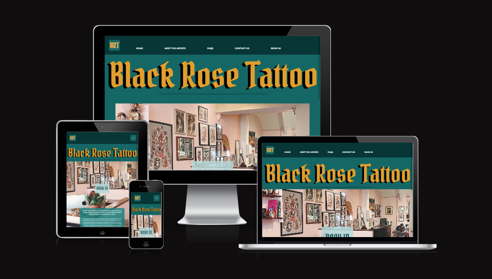

Visit the deployed website: [Black Rose Tattoo](https://veebee4.github.io/blackrosetattoo/)

## **Project Description**

This website has been built to improve on the current, existing squarespace website for Black Rose Tattoo, I have undertaken this project as the shop belongs to a good friend of mine, also I have a passion for tattoos and this is the studio that I go to.
I wanted to create this website to improve on the aesthetics and accessibility for information about Black Rose Tattoo, its tattoo artists and booking appointments.

[YouGov](https://yougov.co.uk/society/articles/43350-should-visible-tattoos-be-allowed-workplace) wrote an article about tattoos and the workplace, which showed that a 1/4 of Britons have tattoos and this is likely to keep growing with the acceptance of tattoos becoming a more widespread global opinion in recent years.

## CONTENTS

* [User Experience](#user-experience-ux)
  * [User Stories](#user-stories)

* [Design](#design)
  * [Colour Scheme](#colour-scheme)
  * [Typography](#typography)
  * [Imagery](#imagery)
  * [Wireframes](#wireframes)
  * [Features](#features)
    * [Future Implementations](#future-implementations)
  * [Accessibility](#accessibility)

* [Technology Used](#technology-used)
  * [Languages Used](#languages-used)
  * [Frameworks, Libraries & Programs Used](#frameworks-libraries--programs-used)

* [Deployment & Local Development](#deployment--local-development)
  * [Deployment](#deployment)
  * [Local Development](#local-development)
    * [How to Fork](#how-to-fork)
    * [How to Clone](#how-to-clone)

* [Testing](#testing)
  * [Solved Bugs](#solved-bugs)
  * [Known Bugs](#known-bugs)
  
* [Credits](#credits)
  * [Code Used](#code-used)
  * [Content](#content)
  * [Acknowledgments](#acknowledgments)

--- 

## User Experience UX

- ### User Stories

- #### First Time Visitor Goals

  1. As a first time visitor, I want to be able to navigate through the site and find the content I want without difficulty.
  2. As a first time visitor, I want to be able to book in easily.
  3. As a first time visitor, I want to have initial tattoo questions answered on a page so I don't have to contact anyone first.
  4. As a first time visitor, I would like to view current/existing work by the artist.

- #### Returning Visitor Goals

  1. As a returning visitor, I want to be able to easily and quickly find to contact details again.
  2. As a returning visitor, I want to be able to gain quick access the artists' up-to-date work.

- #### Frequent Visitor Goals

  1. As a frequent visitor, I want to be able to see if any new artists have been added to the studio.

---

### Design

- #### Colour Scheme

  I initially chose a colour scheme of grey and pink but once I had applied the colours early on I decided that it did not work and did not provide the look I was going for. I then found a colour palette of shades of teal which I have used and also added to with selections of my own, complimented with gold accents, with black and white details to provide the necessary distinction between background and content.
  All colours are displayed within a commented section of my css so that if you need to change anything, you can make the changes in this section and it will apply to the classes, some of which cover repeated elements throughout the website.

| Website Element                   | Colour           |
| --------------------------------- |:----------------:|
| Background of Navigation & Footer | #013636          |
| Background of All Pages           | #006666          |
| Page Titles                       | #011d1d          |
| Body Text & Icons                 | White            |

  I used a slightly lighter teal, for the background of all pages to distinguish the difference between header, footer and main section of the webpage.
  All text and icons are in white to ensure this is easily visible to the user.
  I have used a darker teal for the page titles, I made this a little darker than the below colours on the palette I had chosen, again to really make the text distinguishable.

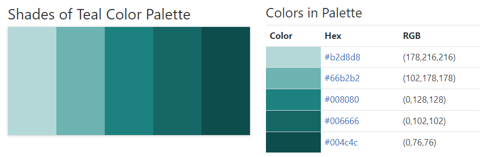

- #### Typography

  Google Fonts was used to import the chosen fonts for use on the site.

  - For the Page Title I have used the google font [Pirata One](https://fonts.google.com/specimen/Pirata+One?query=pirata+one) Pirata One is a font that is close to black lettering which is a calligraphy style commonly used by tattoo artists.

  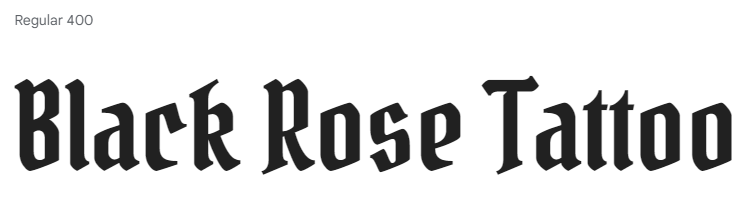

  - I have also chosen [Montserrat](https://fonts.google.com/specimen/Montserrat?query=montserrat) as my other font, which is clear and easily readable.

  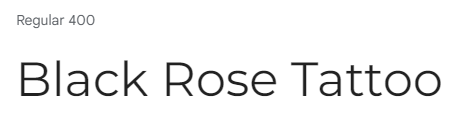

  I have also named the sans-serif font as a fallback font in case the other chosen fonts do not show for any reason.

- #### Imagery

  - This is an important aspect of this website as tattoo's are a visual commodity, images will showcase the studio and also examples of the artists work. The main image on the home page gives the user a sneak peak at the tattoo studio before setting foot in the physical location.
  - Any images used have been obtained with permission by the Studio owner.

- #### Wireframes

  - Home Page Wireframes [Desktop](documentation/wireframes/home-wireframe.png) [Mobile](documentation/wireframes/home-mobile-wireframe.png)
  - Meet The Artists Wireframe [Tablet](/documentation/wireframes/meet-the-artists-tablet-wireframe.png)
  - FAQ Page Wireframe [Desktop](documentation/wireframes/faqs-wireframe.png)
  - Contact Us Page Wireframe [Desktop](documentation/wireframes/contact-us-wireframe.png)
  - Booking In Page Wireframe [Desktop](documentation/wireframes/book-in-wireframe.png) [Mobile](documentation/wireframes/book-in-mobile-wireframe.png)

  My website design has been slightly changed and tweaked from the original design on the wireframes, this is purely down to aesthetics.

## Technology Used

This project is written using HTML & CSS in Gitpod. I have also used flex-box and bootstrap to make the site responsive, and it is currently being hosted on GitHub.

## Features

The website comprises of a homepage, meet the artists page to introduce the artists working at the studio, an faq page, along with a contact and booking in page. The form on the booking in page re-directs to a thank you page once the form has been filled in and the submit button has been pressed.

- Responsive on all devices, using a mobile first approach.
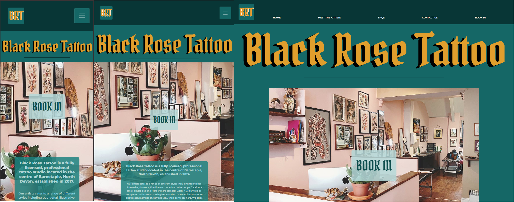

- Interactive Menus and links on all pages.
- Street Map.

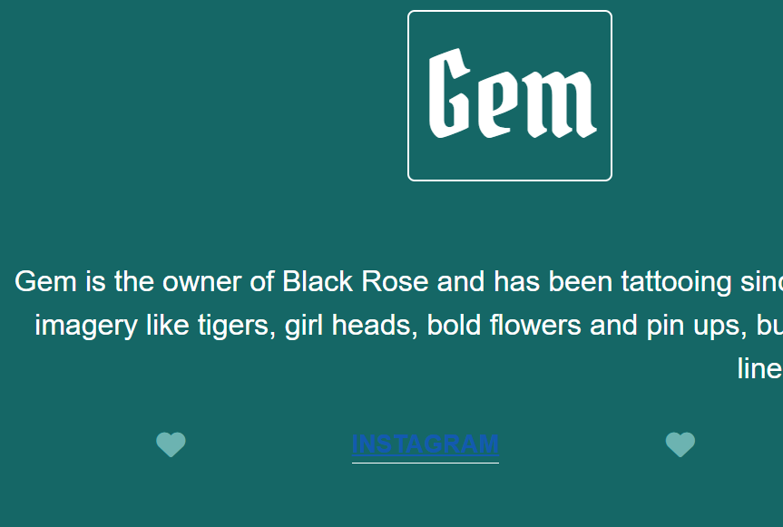
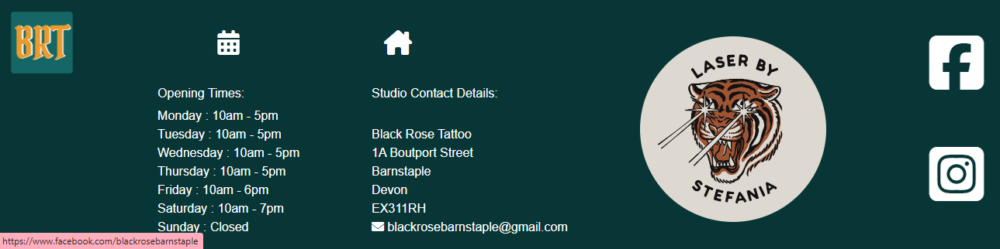
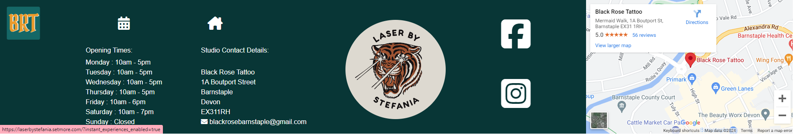

- Small logo's on the header and footer that act as a link back to the home page.
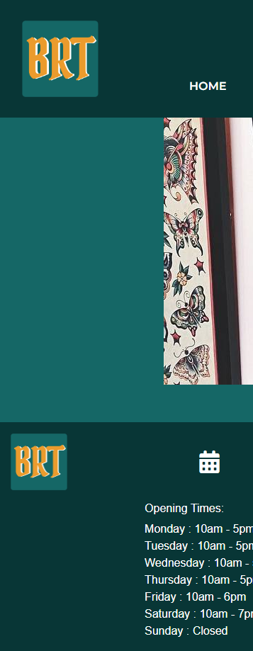

- User feedback on FAQ page when question is hovered over.
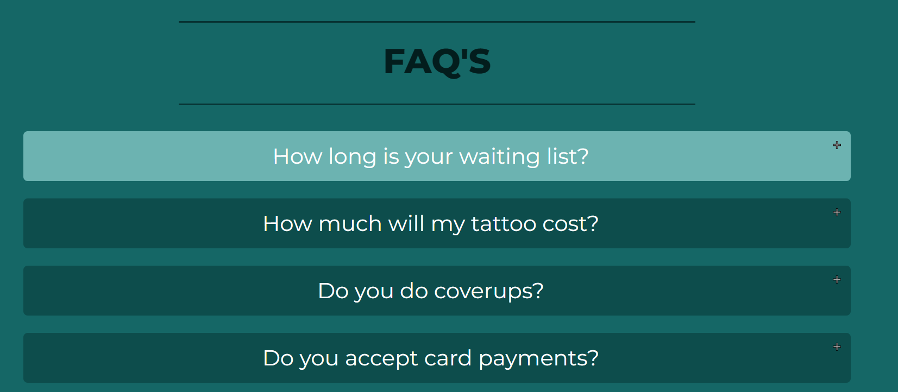

#### Future Implementations

For future implementations I would like to:

1. Add pages to showcase a gallery of each artists work so that the user doesn't have to visit social media to view their work.
2. Have a page which branches off into the other services that are offered at the studio; Laser removal and Semi-Permanent Makeup.
3. Create a more detailed booking in form.
4. Create a shop to sell all the artists merchandise.
5. Improve performance of whole site.

### Accessibility

I have been trying to make the project and website as accessible as possible. I have been doing this by:

* Using semantic HTML.
* Using the hover element on all buttons on the site to make it known to the user that they are hovering over a button.
* Making sure all pictures have an alt attribute.
* Ensuring that there is a enough colour contrast throughout the site and the background (and background image) does not distract from the content.
* Displaying appropriate title on page tab, so users can easily see where they are on the site, just by looking at the tab.

### Languages Used

- HTML5
- CSS3
- Javascript (Scripts copied from tutorials only to make certain elements work)

### Frameworks, Libraries & Programs Used

   + [Bootstrap 4.3.1:](https://getbootstrap.com/docs/4.4/getting-started/introduction/)
      - Bootstrap was used to create a responsive navigation menu to allow for a hamburger menu once the screen size reduced from desktop/
   + [Hover.css:](https://ianlunn.github.io/Hover/)
      - Hover.css was used on buttons and the faq questions to allow feedback for the user.
   + [Google Fonts:](https://fonts.google.com/)
      - Google fonts were used by importing the fonts Pirata One and Montserrat, into the style.css file which has been used on all pages within the project.
   + [Font Awesome:](https://fontawesome.com/)
      - Font Awesome was used to add icons for aesthetic purposes.
   + [jQuery:](https://jquery.com/)
      - jQuery comes with Bootstrap and makes the navbar responsive.
   + [Git](https://git-scm.com/)
      - The git command was used for version control via the terminal in Gitpod, to commit to Git and Push to GitHub.
   + [GitHub:](https://github.com/)
      - GitHub is used to save and store the files and projects code after being pushed from Git.
   + [Balsamiq:](https://balsamiq.com/)
      - Balsamiq was used to create wireframes.
   + [Google Developer Tools](https://developers.google.com/web/tools) 
      - To troubleshoot and test features, solve issues with responsiveness and styling.
   + [Am I Responsive?](http://ami.responsivedesign.is/)
      - To show the website home page image on a range of devices.
   + [Procreate](https://procreate.com/)
      - Used to design the text logo and the mini logo for the header and footer.

## Deployment & Local Development

### Deployment

The site is deployed using GitHub Pages - [Black Rose Tattoo](https://veebee4.github.io/blackrosetattoo/).

To Deploy the site using GitHub Pages:

1. Login (or signup) to Github.
2. Go to the repository for this project, [veebee4/blackrosetattoo](https://github.com/veebee4/blackrosetattoo).
3. Click the settings button.
4. Select pages in the left hand navigation menu.
5. From the source dropdown select main branch and press save.
6. The site has now been deployed, please note that this process may take a few minutes before the site goes live.

### Local Development

#### How to Fork

To fork the repository:

1. Log in (or sign up) to Github.
2. Go to the repository for this project, [veebee4/blackrosetattoo](https://github.com/veebee4/blackrosetattoo)
3. Click the Fork button in the top right corner.

#### How to Clone

To clone the repository:

1. Log in (or sign up) to GitHub.
2. Go to the repository for this project, [veebee4/blackrosetattoo](https://github.com/veebee4/blackrosetattoo)
3. Click on the code button, select whether you would like to clone with HTTPS, SSH or GitHub CLI and copy the link shown.
4. Open the terminal in your code editor and change the current working directory to the location you want to use for the cloned directory.
5. Type 'git clone' into the terminal and then paste the link you copied in step 3. Press enter.

- - -

## Testing

  Please click [HERE](testing.md) for all testing.

### Solved Bugs

| No   | Bug  | How I solved the issue |
| :--- | :--- | :--- |
| 1 | After reading that Bootstrap was not required for this project on the Slack channels I was trying to work without the bootstrap framework and found it extremely difficult to code a completely HTML and CSS hamburger menu | After speaking with my tutor, she suggested that I could use the bootstrap framework just for the menu and that would be acceptable for the project, I read the documentation on the Bootstrap navigation element and implemented this into my site |
| 2 | For the contact page, I wanted a map to be at the bottom of the content on that page and also for it to be responsive, I had placed an embedded map but it was only one size and did not look good within other device sizes | I typed my query into google and found a good [tutorial](https://www.w3schools.com/howto/howto_css_responsive_iframes.asp) on W3 schools which showed how to style the class for the map|
| 3 | The font for the navigation links would not change to the particular font I wanted | I researched this and managed to find [this article](https://forum.squarespace.com/topic/253132-custom-css-not-overriding-font-styles-site-nav-links/) where I learnt about the !important attribute and fixed this issue. This attribute was then used for other elements |

### Known Bugs

* When testing was carried out on an Iphone 12 mobile, the booking in form does not display correctly; the title is off center, the checkbox is left aligned for some reason and users have to scroll to the right slightly to view the end of the text box. This is all displayed correctly when viewing on a desktop and reducing the screen size either just through the browser or through devtools.

  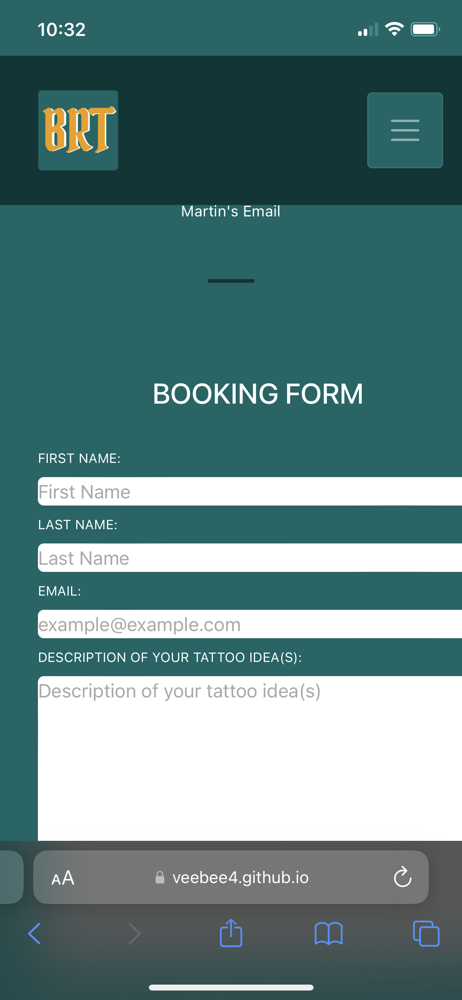

* I noticed the border style that I had applied to the menu links, applies itself to the full width on the hamburger menu but only appears under the navigation link on the full desktop menu. This could be rectified just by spending further time on the project.

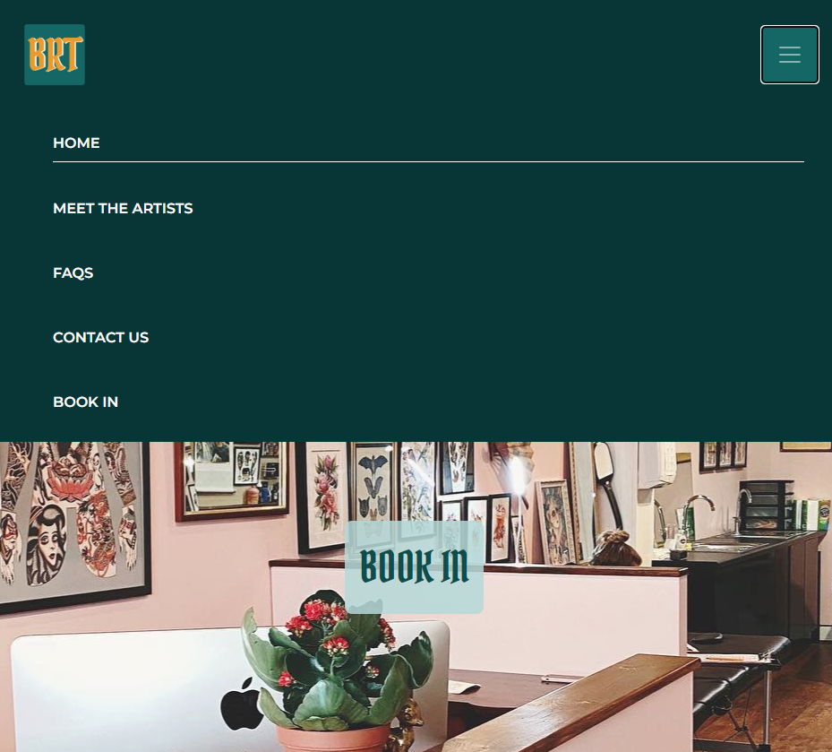

- - -

## Credits

### Code Used

* I used [This Tutorial](https://forum.squarespace.com/topic/253132-custom-css-not-overriding-font-styles-site-nav-links/) where I learned how to make css !important to over-ride other applied css styles.

* I read [Bootstrap documentation](https://getbootstrap.com/docs/4.3/getting-started/introduction/) to learn about the responsive navigation element, in order to make it change to the hamburger menu for smaller screen sizes than laptops.

* I utilised the [Flexbox Froggy](https://flexboxfroggy.com/) game in combination with [This Guide](https://css-tricks.com/snippets/css/a-guide-to-flexbox/) in order to teach myself how to use Flexbox.

* I used this [video tutorial](https://www.youtube.com/watch?v=N5wpD9Ov_To) on YouTube by [Kevin Powell](https://www.youtube.com/@KevinPowell) to ensure I was using the correct units within my css.

* I found [This Tutorial](https://stackoverflow.com/questions/31379175/bootstrap-button-on-click-showing-default-colour) which showed me how to change button colour once pressed, for the booking in button on the main home page.

* I used [This Tutorial](https://www.w3schools.com/howto/howto_js_collapsible.asp) to learn how to make collapsable questions on the FAQs page.

* I used [This Tutorial](https://www.w3schools.com/howto/howto_css_responsive_iframes.asp) to show a responsive sized map on contact us page.

* I was shown [This Tutorial](https://stackoverflow.com/questions/13766015/is-it-possible-to-configure-a-required-field-to-ignore-white-space) by my mentor to show how to ensure a user does not put whitespace onto a form in order to override the required attribute.

* My mentor also showed me [This Tutorial](https://www.w3schools.com/html/html_favicon.asp) to be able to display a unique icon in the page tab.

* I used [This Tutorial](https://byby.dev/md-image-size) to learn how to be able to re-size images in a markdown file.

### Content

All text content for the site has been pulled from the original website and all logo's were created by me.

### Acknowledgments

I would like to acknowledge the following people:

* Niclas_5P_Lead - On the Code Institute slack channels, who provided me with thorough help and advice.

* Tutor Support at Code Institute - Who provided me with guidance and learning materials, helpful hints and tips.

* Rachel Furlong - My college tutor, who maintained contact throughout the project and provided reassurance.

* Jubril Akolade - My mentor, who provided me with great guidance and reassurance.

