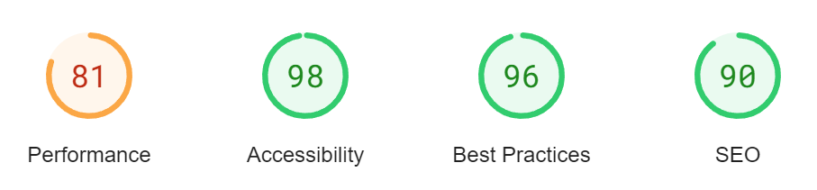

# Black Rose Tattoo - Testing

Visit the deployed website: [Black Rose Tattoo](https://veebee4.github.io/blackrosetattoo/)

- - -

# CONTENTS

* [MANUAL TESTING](#manual-testing)
  * [Testing User Stories](#testing-user-stories)
    * [First Time Visitor](#first-time-visitor)
    * [Returning Visitor](#returning-visitor)
    * [Frequent Visitor](#frequent-visitor)
  * [Full Testing](#full-testing)
    * [Home Page](#home-page)
    * [Meet The Artists](#meet-the-artists)
    * [FAQs](#faqs)
    * [Contact Us](#contact-us)
    * [Book In](#book-in)
* [AUTOMATED TESTING](#automated-testing)
  * [W3C Validator](#w3c-validator)
  * [JavaScript Validator](#javascript-validator)
  * [Chrome DevTools Audit Report](#chrome-devtools-audit-report)

  I carried out testing throughout the project, by using Chrome developer tools I was able to troubleshoot as the project was being built.
  All pages have been viewed in the Chrome developer tools to ensure each page is responsive on different device and screen sizes.

## MANUAL TESTING

### Testing User Stories

- #### First Time Visitor

  1. As a first time visitor, I want to be able to navigate through the site and find the content I want without difficulty.
    1. Upon loading the home page, users are automatically presented with a simple, clean and easily readable navigation bar to go to the page of their choice, each navigation link states the page unambiguously and plainly, and displays a bottom border when the user hovers over it, providing feedback to the user that they are hovered over that page. Underneath there is a logo clearly displaying 'Black Rose Tattoo', so the user knows exactly where they are.
    2. The navigation bar sticks to the top of each page when the user scrolls further down the page, so all pages are easily accessible at any point during the users' visit.
    3. On the booking in page, there is a form to provide all information for the user to be able to book in effectively. On pressing submit, the user is redirected to a thank you page and the header and footer is accessible on this page so the user can take themselves back to any other page, if they wish.

    

  2. As a first time visitor, I want to be able to book in easily.
    1. When the visitor loads the home page, within the nav bar at the top of the page there is a navigation link to the booking in page, or the user can scroll down to see an image of the studio that contains a centered booking in button, this means the user can access the booking in page from all pages, at any point within the page.
    2. The booking in form itself is easy to read and simple to use with each text area appropriately labelled, what it is for. The input areas and checkbox all have the required attribute (apart from the uploading of reference photos which is not required), so the user can also ensure they are booked in effectively as all information is required by the studio.

    

  3. As a first time visitor, I want to have initial tattoo questions answered on a page so I don't have to contact anyone first.
    1. The user can easily navigate to the clearly marked FAQ page from any page on the website. They can then view the questions via a collapsable element meaning they can just view the questions they require answers for.
    2. Each question is a button which changes to a lighter colour to show feedback to the user as to which question they are currently hovering over. The user then needs to click on the question and the answer is expanded below.

    
    

  4. As a first time visitor, I would like to view current/existing work by the artist.
    1. The user can navigate to the 'Meet The Artists' page, whereby they will find links to the artists' social media and a sneak peak an example of each artists' work.
    2. The links to each artists Instagram are clearly marked underneath each artist picture and introduction. These links have been coded to open into a new tab so the user isn't taken away from the main website completely.

    

- #### Returning Visitor

  1. As a returning visitor, I want to be able to easily and quickly find to contact details again.
    1. The user can go straight to the contact page by going through the navigation link 'Contact Us' at the top of the page or they can obtain information straight away by going to the footer in place on every page, where it has become a standard practice to provide this information.

  2. As a returning visitor, I want to be able to gain quick access the artists' up-to-date work.
    1. The user can either visit the studios Instagram, which is represented by an icon on the footer of each page, or they can visit the 'Meet The Artists' page and go to the specific artists' instagram which is shown as a link under the artists' picture and introduction.

    

- #### Frequent Visitor Testing

  1. As a frequent visitor, I want to be able to see if any new artists have been added to the studio.
    1. Any new artists will be added to the list of artists on the 'Meet The Artists' page, which is self explanatory and would jump out at the user as being the first place to check.

  #### Full Testing

  ##### Home Page

| Feature | Expected Outcome | Testing Performed | Result | Pass/Fail |
| --- | --- | --- | --- | --- |
| Site Mini Logo's | Link directs the user back to the home page | Clicked title | Home page reloads | Pass |
| Navigation Links | Links direct user to appropriate page | Clicked each link | Each link takes user to correct page | Pass |
| Book In Button | Takes user to booking in page | Clicked on booking in button | Booking in page is loaded | Pass |
| Book In Button Hover Effect | Button turns to a darker shade of teal when user hovers over it | Hover over booking in button | Button shows correct colour when hovering over it | Pass |
| Laser By Stephania Logo/Button | Opens Laser by Stephania booking page in a new tab | Clicked on logo/button | A new tab opens and loads the correct page | Pass |
| Social Media Icons | Opens a new tab to each social media account for the studio | Clicked on each icon | A new tab opens and loads the correct pages | Pass |

  ##### Meet The Artists

| Feature | Expected Outcome | Testing Performed | Result | Pass/Fail |
| --- | --- | --- | --- | --- |
| Site Mini Logo's | Link directs the user back to the home page | Clicked title | Home page reloads | Pass |
| Navigation Links | Links direct user to appropriate page | Clicked each link | Each link takes user to correct page | Pass |
| Links for each artist | Opens each link in a new tab, email link opens new email in users default programme | Clicked on each link | Both webpage links open into a new tab displaying appropriate page and email opens a new email in Outlook | Pass |
| Laser By Stephania Logo/Button | Opens Laser by Stephania booking page in a new tab | Clicked on logo/button | A new tab opens and loads the correct page | Pass |
| Social Media Icons | Opens a new tab to each social media account for the studio | Clicked on each icon | A new tab opens and loads the correct pages | Pass |

  ##### FAQs

| Feature | Expected Outcome | Testing Performed | Result | Pass/Fail |
| --- | --- | --- | --- | --- |
| Site Mini Logo's | Link directs the user back to the home page | Clicked title | Home page reloads | Pass |
| Navigation Links | Links direct user to appropriate page | Clicked each link | Each link takes user to correct page | Pass |
| Question Button | Expands answer below when clicked | Clicked on each question button | Answers are displayed correctly below question | Pass |
| Question Button Hover Effect | Button turns to a lighter shade of teal when user hovers over it | Hover over each question button | Button shows correct colour when hovering over it | Pass |
| Laser By Stephania Logo/Button | Opens Laser by Stephania booking page in a new tab | Clicked on logo/button | A new tab opens and loads the correct page | Pass |
| Social Media Icons | Opens a new tab to each social media account for the studio | Clicked on each icon | A new tab opens and loads the correct pages | Pass |

  ##### Contact Us

| Feature | Expected Outcome | Testing Performed | Result | Pass/Fail |
| --- | --- | --- | --- | --- |
| Site Mini Logo's | Link directs the user back to the home page | Clicked title | Home page reloads | Pass |
| Navigation Links | Links direct user to appropriate page | Clicked each link | Each link takes user to correct page | Pass |
| Email the Studio Link | Link opens new email | Clicked on link | A new email is opened in Outlook | Pass |
| Laser By Stephania Logo/Button | Opens Laser by Stephania booking page in a new tab | Clicked on logo/button | A new tab opens and loads the correct page | Pass |
| Social Media Icons | Opens a new tab to each social media account for the studio | Clicked on each icon | A new tab opens and loads the correct pages | Pass |

  ##### Book In

| Feature | Expected Outcome | Testing Performed | Result | Pass/Fail |
| --- | --- | --- | --- | --- |
| Site Mini Logo's | Link directs the user back to the home page | Clicked title | Home page reloads | Pass |
| Navigation Links | Links direct user to appropriate page | Clicked each link | Each link takes user to correct page | Pass |
| Buttons For All Email Links | Opens a new email to either studio or artists address | Clicked on each picture button | A new email opens in Outlook | Pass |
| Form | Once user has filled in all required inputs, ticked check box and pressed submit, user taken to thank you page | Filled in all text areas, ticked checkbox and clicked on submit button | Directs user to thank you page | Pass |
| Clear Form Button | Removes inputted text from all text inputs | Clicked on button | All information removed | Pass |
| Laser By Stephania Logo/Button | Opens Laser by Stephania booking page in a new tab | Clicked on logo/button | A new tab opens and loads the correct page | Pass |
| Social Media Icons | Opens a new tab to each social media account for the studio | Clicked on each icon | A new tab opens and loads the correct pages | Pass |

## AUTOMATED TESTING

### W3C Validator

    [W3C] was used to validate all HTML & CSS code.

    | Page | Result |
    | --- | --- |
    | index.html | Passed - [Result](documentation/testing/w3c-index.png) |
    | meet-the-artists.html | Passed - [Result](documentation/testing/w3c-meet-artists.png) |
    | faqs.html | Passed - [Result](documentation/testing/w3c-faqs.png)
    | contact-us.html | Passed - [Result](documentation/testing/w3c-contact.png) |
    | book-in.html | Passed - [Result](documentation/testing/w3c-book.png) |
    | style.css | Passed - [Result](documentation/testing/w3c-css.png)

### Javascript Validator

    [JSHint](https://jshint.com) was used to validate the small amount of Javascript within the project.
    

### Chrome DevTools Audit Report

  The Google Page-speed Services/Lighthouse was used to assess the accessibiity of the project to ensure the site met expected accessible standards on desktop and mobile. From this result, I can see that the performance on my website could be better and this could be improved upon on future releases - the project scored highly in all other areas.

  

- #### Browser Testing

  - The Website has been tested on Google Chrome, Safari, and Microsoft Edge.
  - The website was tested on my iPhone 12 mobile and 27" Microsoft PC devices. All other responsive testing was completed online.
  - Testing has been completed to ensure that all pages were linking correctly and external links opened in a new tab.
